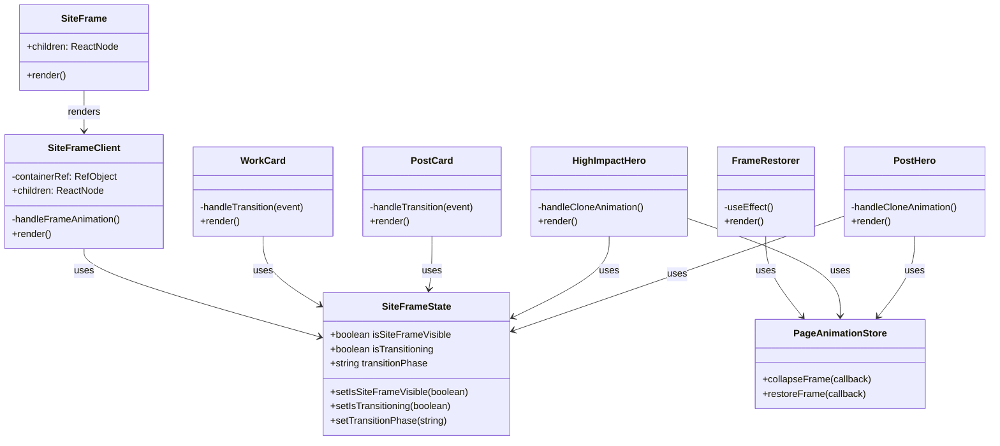
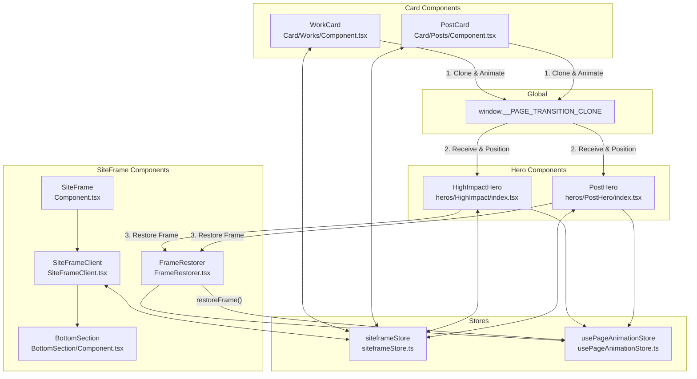
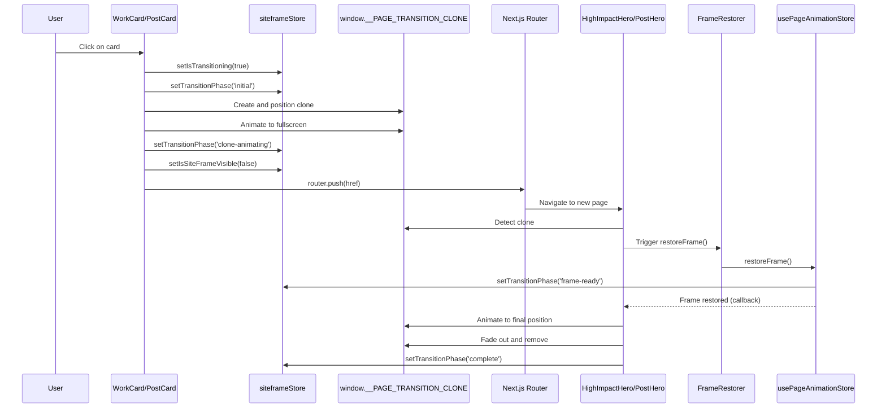

# SiteFrame System

A sophisticated frame and page transition system for Next.js websites that provides smooth, animated transitions between pages with coordinated frame visibility.

## Architecture Overview

The SiteFrame system consists of several interconnected components and stores that work together to create a cohesive visual experience:



### Components

1. **SiteFrame**
   - Simple wrapper component that renders SiteFrameClient
   - Located in `src/SiteFrame/Component.tsx`

2. **SiteFrameClient**
   - Main component that renders the frame UI with animated bars
   - Handles frame visibility based on the siteframeStore state
   - Uses GSAP animations for fade-in effects
   - Located in `src/SiteFrame/SiteFrameClient.tsx`

3. **BottomSection**
   - Renders content in the bottom frame bar (time, logo, contact link)
   - Handles viewport height calculations for mobile browsers
   - Located in `src/SiteFrame/BottomSection/Component.tsx`

4. **FrameRestorer**
   - Utility component that restores the frame when mounted or on route changes
   - Listens to pathname changes to trigger frame restoration
   - Located in `src/SiteFrame/FrameRestorer.tsx`

### State Management

The system uses Zustand stores for state management:

1. **siteframeStore**
   - Controls frame visibility and transition state
   - Located in `src/stores/siteframeStore.ts`
   - Key state:
     - `isSiteFrameVisible`: Controls whether the frame is shown
     - `isTransitioning`: Tracks if a transition is in progress
     - `transitionPhase`: Tracks transition phases ('initial', 'clone-animating', 'frame-ready', 'complete')

2. **usePageAnimationStore**
   - Contains animation logic for the frame
   - Located in `src/templates/shared/usePageAnimationStore.ts`
   - Key functions:
     - `collapseFrame`: Animates horizontal bars height to 0 and vertical bars width to 0
     - `restoreFrame`: Sequentially animates frame bars with a GSAP timeline

### Component Relationships



## Page Transition System

The SiteFrame is integrated with a sophisticated page transition system that creates smooth visual flows between pages.

### Transition Flow



1. **Card Click Initiation**
   - User clicks a card (WorkCard/PostCard)
   - Card component clones the media element and stores it in `window.__PAGE_TRANSITION_CLONE`
   - Sets transition state (`setIsTransitioning(true)`)
   - Sets initial transition phase (`setTransitionPhase('initial')`)
   - Animates clone to full screen using GSAP Flip
   - Updates transition phase to 'clone-animating'
   - Hides the frame (`setIsSiteFrameVisible(false)`)
   - Navigates to the target page

2. **Hero Component Reception**
   - Target page's hero component (HighImpactHero/PostHero) detects the clone
   - Animates the clone to its final position in the hero
   - Restores the frame with animation
   - Updates transition phase to 'frame-ready' when frame begins restoring
   - Updates transition phase to 'complete' when animation finishes
   - Removes the clone from the DOM

### Frame Animation Sequence

1. **Frame Collapse** (`collapseFrame`)
   - Animates horizontal bars height to 0
   - Animates vertical bars width to 0
   - Uses GSAP for smooth animations with power2.in easing

2. **Frame Restore** (`restoreFrame`)
   - Creates a GSAP timeline for sequential animation
   - Animates top horizontal bar first
   - Animates vertical bars next with slight overlap (-=0.4)
   - Animates bottom horizontal bar last with slight overlap (-=0.4)
   - Uses computed styles to match the actual frame dimensions

## Integration Points

The SiteFrame system is integrated into the site at several key points:

1. **Root Layout** (`src/app/(frontend)/layout.tsx`)
   - SiteFrame wraps all content
   - FrameRestorer is included to ensure frame restoration

2. **Card Components**
   - WorkCard (`src/components/Card/Works/Component.tsx`)
   - PostCard (`src/components/Card/Posts/Component.tsx`)
   - Both handle click events and initiate transitions

3. **Hero Components**
   - HighImpactHero (`src/heros/HighImpact/index.tsx`)
   - PostHero (`src/heros/PostHero/index.tsx`)
   - Both handle the receiving end of transitions

## Usage Example

### Adding SiteFrame to a Layout

```tsx
// In your layout component
import { SiteFrame } from '@/SiteFrame/Component'
import FrameRestorer from '@/SiteFrame/FrameRestorer'

export default function Layout({ children }) {
  return (
    <>
      <SiteFrame>{children}</SiteFrame>
      <FrameRestorer />
    </>
  )
}
```

### Creating a Card with Transition

```tsx
// In your card component
import { useSiteFrameStore } from '@/stores/siteframeStore'
import gsap from 'gsap'
import Flip from 'gsap/Flip'

const Card = () => {
  const { 
    setIsSiteFrameVisible, 
    setIsTransitioning, 
    setTransitionPhase 
  } = useSiteFrameStore()

  const handleTransition = (e) => {
    e.preventDefault()
    
    // Set transition state
    setIsTransitioning(true)
    setTransitionPhase('initial')
    
    // Clone media element
    const clone = mediaEl.cloneNode(true)
    clone.classList.add('page-transition-clone')
    window.__PAGE_TRANSITION_CLONE = clone
    document.body.appendChild(clone)
    
    // Position clone
    const rect = mediaEl.getBoundingClientRect()
    Object.assign(clone.style, {
      position: 'fixed',
      top: `${rect.top}px`,
      left: `${rect.left}px`,
      width: `${rect.width}px`,
      height: `${rect.height}px`,
      zIndex: '10000',
    })
    
    // Animate clone with GSAP Flip
    const state = Flip.getState(clone)
    Object.assign(clone.style, {
      top: '0',
      left: '0',
      width: '100vw',
      height: '100vh',
    })
    
    Flip.from(state, {
      duration: 1.2,
      ease: 'power2.inOut',
      onStart: () => setTransitionPhase('clone-animating'),
      onComplete: () => {
        setIsSiteFrameVisible(false)
        router.push(href)
      }
    })
  }
  
  return (
    <Link href="/page" onClick={handleTransition}>
      {/* Card content */}
    </Link>
  )
}
```

### Creating a Hero Component

```tsx
// In your hero component
import { useSiteFrameStore } from '@/stores/siteframeStore'
import { usePageAnimationStore } from '@/templates/shared/usePageAnimationStore'

const Hero = () => {
  const { setTransitionPhase } = useSiteFrameStore()
  const restoreFrame = usePageAnimationStore((s) => s.restoreFrame)
  
  useEffect(() => {
    const clone = window.__PAGE_TRANSITION_CLONE
    if (!clone) return
    
    // Get the final position of the media element
    const { top, left, width, height } = mediaEl.getBoundingClientRect()
    
    // Restore frame
    restoreFrame(() => {
      setTransitionPhase('frame-ready')
      
      // Animate clone to final position
      gsap.timeline({
        onComplete: () => {
          clone.remove()
          window.__PAGE_TRANSITION_CLONE = undefined
          setTransitionPhase('complete')
        }
      })
      .to(clone, {
        top,
        left,
        width,
        height,
        duration: 0.8,
        ease: 'power3.inOut',
      })
      .to(clone, {
        opacity: 0,
        duration: 0.3,
      }, '>-0.1')
    })
  }, [restoreFrame, setTransitionPhase])
  
  return (
    // Hero content
  )
}
```

## Technical Details

### Global Types

The system extends the global Window interface to include the transition clone:

```typescript
// In global.d.ts
declare global {
  interface Window {
    __PAGE_TRANSITION_CLONE?: HTMLElement
  }
}
```

### Animation Libraries

The system uses:
- GSAP for animations (gsap, Flip plugin)
- @gsap/react for React integration (useGSAP)

### Browser Compatibility

The system includes special handling for mobile browsers:
- Sets custom viewport height variable (`--vh`) to handle mobile browser chrome
- Updates on resize and orientation change

## Best Practices

1. **Consistent Transition Phases**
   - Always follow the transition phase sequence: 'initial' → 'clone-animating' → 'frame-ready' → 'complete'
   - Update phases at appropriate points in the animation lifecycle

2. **Frame Visibility Management**
   - Hide frame during transitions with `setIsSiteFrameVisible(false)`
   - Restore frame at the right time in the receiving component

3. **Animation Performance**
   - Use `will-change-transform` for better performance (already applied to frame bars)
   - Use GSAP contexts for better memory management
   - Clean up clones and event listeners properly

4. **Error Handling**
   - Include fallbacks for when clone or media elements are not available
   - Always provide direct navigation as a fallback 